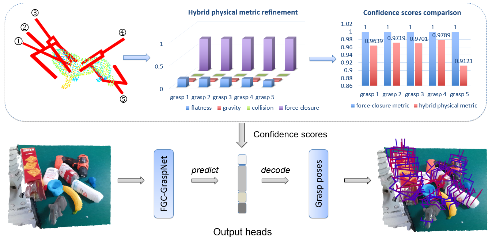

# FGC-GraspNet
Official Implementation for paper "Hybrid Physical Metric For 6-DoF Grasp Pose Detection" ICRA 2022. 

[arxiv](https://arxiv.org/abs/2206.11141)




## Data Preparation
Download the GraspNet-1Billion dataset from [graspnet](https://graspnet.net/datasets.html).
In this paper, we use a new evaluation metric to generate grasp confidence scores for grasp poses.
You can get the new score labels under hybrid physical metric from [here](https://drive.google.com/u/0/uc?id=1wAcGKOAO3EKWV0iih5sSVW5fHsu0X11R&export=download).
The data directories should like this:

```
FGC_GraspNet/
├── grasp_data/
|       ├── scenes
|       ├── models
|       ├── dex_models
│       ├── FGC_label
│       ├── grasp_label
│       └── collision_label
```

## Requirements
- Python 3.6.13
- PyTorch 1.8.1+cu111
- Open3d 0.8
- TensorBoard 2.3
- NumPy
- SciPy
- Pillow
- tqdm

## Installation
Get the code.
```bash
git clone https://github.com/luyh20/FGC-GraspNet.git
```
Install packages via Pip.
```bash
pip install -r requirements.txt
```
Compile and install pointnet2 operators (code adapted from [votenet](https://github.com/facebookresearch/votenet)).
```bash
cd pointnet2
python setup.py install
```
Compile and install knn operator (code adapted from [pytorch_knn_cuda](https://github.com/chrischoy/pytorch_knn_cuda)).
```bash
cd knn
python setup.py install
```
Install graspnetAPI.
```bash
git clone https://github.com/graspnet/graspnetAPI.git
cd graspnetAPI
pip install .
```


## Training and Testing
Training:
```
sh train.sh
```

Testing:
```
sh test.sh
```

## Model
Realsense model's link，https://drive.google.com/file/d/1Y-CWHr_eZDoZm3XJocrUJq1SA5tfrONX/view?usp=sharing

## Demo
The demo uses the RGBD data collected in real time from the Realsense D435i camera as input, and predicts the grasp poses results by the FGC_GraspNet.
If you want to use it in your own experiment, you need to check the camera model or change the camera intrinsic for your camera model.

Run Demo:
```
python demo.py
```

## Video
[](https://www.youtube.com/watch?v=gMoomsMJU_Y)

## BibTeX
```
@inproceedings{lu2022hybrid,
  title={Hybrid Physical Metric For 6-DoF Grasp Pose Detection},
  author={Lu, Yuhao and Deng, Beixing and Wang, Zhenyu and Zhi, Peiyuan and Li, Yali and Wang, Shengjin},
  booktitle={2022 International Conference on Robotics and Automation (ICRA)},
  pages={8238--8244},
  year={2022},
  organization={IEEE}
}
```
